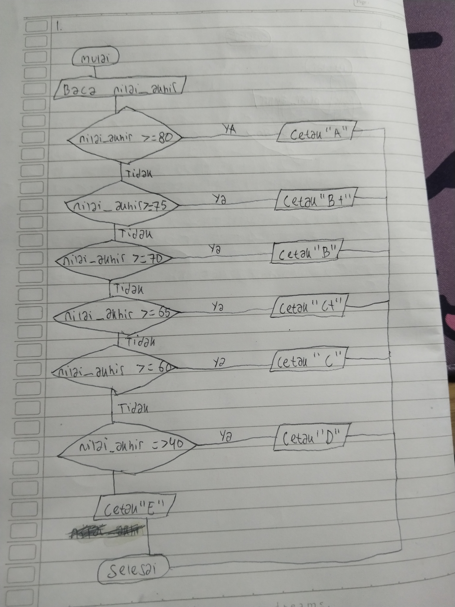
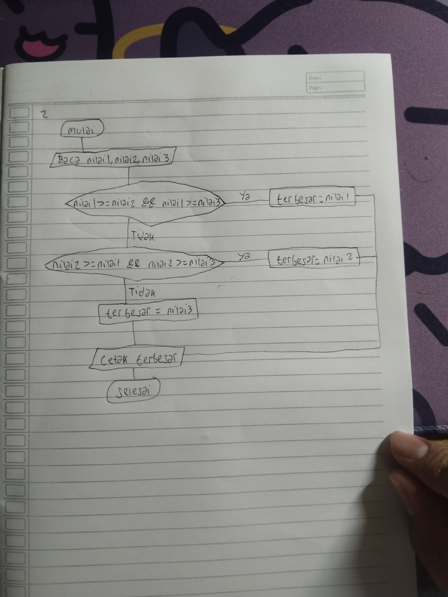

# Praktikum Pemrograman Terstruktur — Pertemuan 4

## Identitas
- **Nama:** Muhammad Azmi Azkia
- **NPM:** 2510010458
- **Program Studi:** Teknik Informatika
- **Mata Kuliah:** Pemrograman Terstruktur
- **Pertemuan:** 4

## D. Latihan Mandiri

### 1. Flowchart Tujuh Tingkat Huruf Mutu
Soal: Gambar flowchart lengkap TODO 1 (tujuh tingkat huruf mutu) di kertas, foto, dan simpan bersama kodemu.
Bandingkan dengan Gambar 4: apa yang berulang?

**Jawab :** Yang berulang adalah bagian nilai_akhir untuk menentukan huruf_mutu 

**Flowchart :**

### 2. Menentukan Bilangan Terbesar
Soal: Tulis program yang membaca tiga bilangan dan mencetak yang terbesar. Gambar flowchart-nya dulu; ada
lebih dari satu cara.

**Flowchart :**

**File kode:** `nilai_terbesar.cpp`

### 3. Menentukan Tahun Kabisat
Soal: Tulis program yang membaca tahun lalu menentukan tahun kabisat: habis dibagi 4 dan tidak habis dibagi 100,
atau habis dibagi 400. Ini latihan &&, ||, dan % sekaligus.

**File kode:** `tahun_kabisat.cpp`

### 4. Menu Menggunakan Switch-Case
Soal: Ubah switch_menu.cpp supaya pilihan dibaca sebagai char ('1', '2', '3') dan tambahkan kasus 'k'
untuk keluar. Apa yang berubah pada case?

**Jawab :** Variabel pilihan diubah dari tipe data int menjadi char agar dapat membaca pilihan menu sebagai karakter. Label case ditulis menggunakan tanda petik tunggal, seperti case '1':, case '2':, dan case '3':. Selain itu, ditambahkan case 'k': untuk menangani pilihan keluar.

**File kode: `ubah_switch_menu.cpp`

### 5. Percabangan Bertingkat Menggunakan Switch
Soal: Tuliskan ulang bertingkat.cpp memakai switch pada static_cast<int>(nilai) / 10. Apakah
hasilnya persis sama untuk 79.9? Jelaskan.

**Jawab :** Hasilnya tidak sama, untuk input 79.9:
1. static_cast<int>(79.9) menghasilkan 79.
2. 79 / 10 menghasilkan 7.
3. Karena tidak ada case 7, program menjalankan default dan mencetak Huruf mutu: D.

**File kode:** `switch_bertingkat.cpp`
